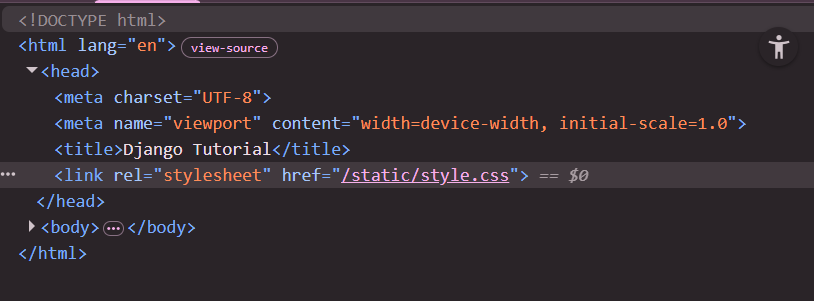
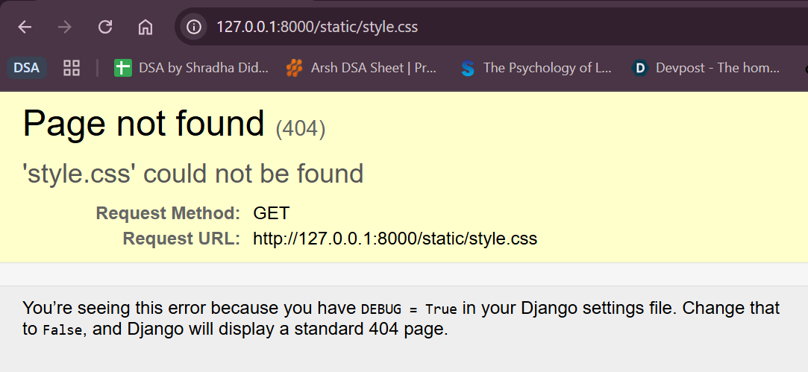
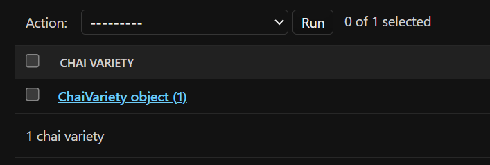
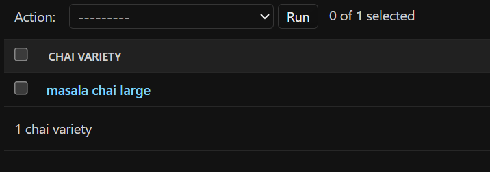
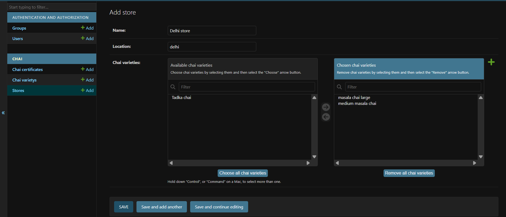

# 1. Starting a Django project
```python
django-admin startproject <project-name> [directory]
```
# 2. Running it
```python
cd <project-name>
python manage.py runserver 8000 (by default)
```
# 3. How to use Templates?
- Jinja is a fast, expressive, and extensible template engine for the Python programming language. It is used to generate dynamic content (like HTML, XML, or plain text configuration files) by filling special placeholders in a template file with actual data from a Python application. this is what we are using.
- Newsflash : My root directory is djangotut, project folder is mysite
- Make a folder 'templates' right inside the root directory, and 'static' folder too inside the root directory where you will store your css and javascript
- html file go under templates

## 3.1 Importing in views.py
    ```python
    from django.shortcuts import render
    return render(request, 'index.html')
    ```
- here the 'index.html' will be directly searched for inside the templates folder 

## 3.2 Configure settings.py
- To load templates, go in settings.py and add the Directory where templates exist
```python
'DIRS': ['templates'],
```
(coz they are already in the root directory)

## 3.3 Configure static and load custom css styles
- You cannot directory load styles.css in index.html from another folder outside "../../static/styles.css" doesn't work
- <h3> Templating Engine </h3> : that html file works as the whole templating engine. means you can "inject" your code into the file.

### 3.3.1 How to Inject?
- 
```python
<link rel="stylesheet" href="">
```
also you need to load the static at the top of html 
```python

```
this is also templating engine
Now if you'll see in inspect code, it's trying to call style.css from static inside the current folder but there doesn't exist any



### 3.3.2 configure in settings.py
```python
import os

STATIC_URL = 'static/'
STATICFILES_DIRS = [os.path.join(BASE_DIR, 'static')]
``` 
PRO-tip : download django extension

# 4. Variables
- Use {{variable-name}} in django

# 5. Apps
- A project can contain multiple apps
- you only create a project once but can have multiple apps inside it.
```python
python manage.py startapp <app-name>
```
- The first step after making an app is to make our main project aware about this new app. 

## 5.1 Configure settings.py
- there are already cooked-in apps in django (built-in (default) apps — the ones that come bundled when you create a new project)
- go to settings.py in your project folder
- Add 'chai' under INSTALLED_APPS
```python
INSTALLED_APPS = [
    'django.contrib.admin',
    'django.contrib.auth',
    'django.contrib.contenttypes',
    'django.contrib.sessions',
    'django.contrib.messages',
    'django.contrib.staticfiles',
    'chai',
]
```
- “Django, please load this app and include its models, migrations, signals, templates, and configuration into the project.” 
- If you don’t add it there, Django ignores the app completely. It’s like creating a room in your house but never connecting electricity to it.

- You don't need to load templates into the settings again. That's a bonus. You can have templates individually for each app in that app or you can make a separate folder in the main project's template folder with your app. Both works. However, adding a template folder in the app itself might be more-used industry standard.

## 5.2 Adding urls.py
- you must have noticed, there's no urls.py in the app folder. there's not - you need to create one. copy paste from the main project - doesn't matter honestly - do it and make a urls.py in your app folder. 
- this urls.py is a sub-url. 
- to share control from the main-project to the app:
project-folder urls.py (main project)
```python
from django.urls import path,include
urlpatterns = [
    path('chai/',include('chai.urls')),
]
```
- whenever u git chai url, then control will be transferred to an app.
- and include urls in chai. control transferred.
- and your app has been included in your project

# 6. Layout file
- templating
- a common file that's used everywhere
- make it in your main project's templates folder
- to get emmet suggestions (settings -> emmet -> include languages -> {django-html , html})
- load static, and load static css, 
```html

```
- to get different title, get an unnamed block, it can be overwritten whenever and has a default value
```html
 Default value 
```
## 6.1 How to use this layout template in a file?
- in the file that u want to use the layout / overwrite it
```html


Home Page


<h1>Home Page | Models</h1>

```
- this is inside your app, which doesn't have the layout.html in the folder, so how it does load it? Rmember we had set Dirs= ["templates"], so django checks for templates in our app folder and if it doesn't find, it does in the templates of our root folder 
```python
TEMPLATES = [
    {
        'BACKEND': 'django.template.backends.django.DjangoTemplates',
        'DIRS': ['templates'],
        'APP_DIRS': True,
        'OPTIONS': {
            'context_processors': [
                'django.template.context_processors.request',
                'django.contrib.auth.context_processors.auth',
                'django.contrib.messages.context_processors.messages',
            ],
        },
    },
]
```

# 7. Integrating Tailwind.css with Django
```python
pip install django-tailwind
pip install 'django-tailwind[reload]'
```
- the 2nd package is for hot reloading and for convenience
- add app in settings.py in the main folder
```python
INSTALLED_APPS = [
    'django.contrib.admin',
    'django.contrib.auth',
    'django.contrib.contenttypes',
    'django.contrib.sessions',
    'django.contrib.messages',
    'django.contrib.staticfiles',
    'chai',
    'tailwind',
]
```
- and run
```python
python manage.py tailwind init
```
- also add the new app name 
```python
INSTALLED_APPS = [
    'django.contrib.admin',
    'django.contrib.auth',
    'django.contrib.contenttypes',
    'django.contrib.sessions',
    'django.contrib.messages',
    'django.contrib.staticfiles',
    'chai',
    'tailwind',
    'theme',
]

TAILWIND_APP_NAME = 'theme'
INTERNAL_IPS = ['127.0.0.1']
```
- because we will run 2 servers that's why we need to pass internal_ips

## 7.1 Installing tailwind through manage.py
- initialize the app theme folder
```python
python manage.py tailwind install
```
- after the packages have downloaded, you'll see in theme->templates-> base.html
```

<!DOCTYPE html>
<html lang="en">
<head>
    <title>Django Tailwind</title>
    <meta charset="UTF-8">
    <meta name="viewport" content="width=device-width, initial-scale=1.0">
    <meta http-equiv="X-UA-Compatible" content="ie=edge">
    
</head>
```
- let us import the templating engines into our layout as well and use tailwind class but it wouldn't work right now.

## 7.2 Resolving Tailwind 
- make another terminal -> venv
- <h1>PRO TIP : Wherever you are writing manage.py just ensure that it is accessible from the directory you are in </h1>
```python
python manage.py tailwind start
```
- continously tailwind start
- if don't see it, restart the server
- if facing errors here, go to settings.py again and below internal_ips paste
```python
NPM_BIN_PATH = r"<where npm>"
```
- run where npm on cmd and paste the path 
- production: 
```
python manage.py tailwind build
```
## 7.3 Enable hot-reloading or auto reloading
- we have already installed the package "django-tailwind[reload]" 
- to make it accessible, we need to configure the settings

- Add "django-browser-reload" in the apps_installed in settings.
```python
INSTALLED_APPS = [
    'django.contrib.admin',
    'django.contrib.auth',
    'django.contrib.contenttypes',
    'django.contrib.sessions',
    'django.contrib.messages',
    'django.contrib.staticfiles',
    'chai',
    'tailwind',
    'theme',
    'django_browser_reload',
]
```
- and in middleware, at the end, KEEP IT AT THE END 
```python
'django_browser_reload.middleware.BrowserReloadMiddleware',
```
- go in urls.py of the main project, paste the path, and keep it at the end, it is the path that actually enables auto reloading - coz this is heavy
<h1> YOU ALSO REMOVE THE HOT-RELOADING PART BEFORE PRODUCTION COZ U DONT NEED IT THERE </H1>
```python
path('__reload__/', include("django_browser_reload.urls")),
```
- after this restart both the terminals

# 8. Django's Admin Panel
- highly configurable
- highly customisable
migrations?
- you never talk directly to the database, django does that for you through its ORM
2 commands
1. Migrate
```python
python manage.py migrate
```
- jo bhi due migrations hai sune vo migrate kar die hai
- Django admin panel uses the built-in authentication system, so login is required to access it
- when you run the above command, auth and admin dono k tables are created in the db
- and if u runserver now, you won't see the migrations errors
2. Create super user
```python
python manage.py createsuperuser
```
- email address - can leave empty and can be made compulsory from the db
- now when u run server and go to "admin/" path, you will be able to see the admin panel. 

---

# 9. Models
- whenever you want to make anything related to the database i.e. the models , you don't make it in the main-project during production.
- You make models in your app folder -> models.py

## 9.1 Handling Images in Models
- saves both the image in the folder and the link to it in the db
- example code below
```python
from django.utils import timezone
class ChaiVariety(models.Model):
    CHAI_TYPE = [
        ('ML', 'MASALA'),
        ('GR', 'GINGER'),
        ('KI', 'KIWI'),
        ('PL', 'PLAIN'),
        ('EL', 'ELAICHI'),
    ]
    name = models.CharField(max_length=100)
    image = models.ImageField(upload_to='chais/') 
    date_added = models.DateField(default=timezone.now)
    type = models.CharField(max_length=2, choices=CHAI_TYPE)
```
- download PILLOW for images
```
py -m pip install Pillow
```
- Now, this will save images. So you have to let settings.py know that you will receive images. 
```python
MEDIA_URL = '/media/'
MEDIA_ROOT = os.path.join(BASE_DIR, 'media')
```
- settings m kar dia but urls ko bhi pata hona chahie ki ye kia hai
- go into urls.py of main project 
1. Import a static asset 
```python
from django.conf import settings
from django.conf.urls.static import static
```
static loads MEDIA_URL from settings.py 

2. Configuring the urls_patterns
```python
urlpatterns = [
    path('admin/', admin.site.urls),
    path('', views.home, name="home"), #don't write / in home in python and django
    path('about/', views.about, name="about"),
    path('contact/', views.contact, name="contact"),
    path('chai/',include('chai.urls')),

    path('__reload__/', include("django_browser_reload.urls")),
] + static(settings.MEDIA_URL, document_root=settings.MEDIA_ROOT)
```
this calls the MEDIA_URL and the MEDIA_ROOT from our settings

## 9.2 Migration
1. Make migrations
- right now, our django doesn't know that we have these models, so we have to tell it to please load the models and do the changes in our db
```python
python manage.py makemigrations 
```
this would make migrations for all the apps but it is advised to only do it for the app that you want
```python
python manage.py makemigrations chai
```
2. Migrate
```python
python manage.py migrate
```

## 9.3 Admin Superpower
- we have this file admin.py in our app folder, we can attach models here and see them in the admin panel
- go in the admin.py of the app and register the model
```python
from .models import ChaiVariety
admin.site.register(ChaiVariety)
```
- and now save it and run the server again. you will see the model 

- in models.py, 
```python
    def __str__(self): #dunder string function
        return self.name
```


## 9.4 Frontend Integration
- we have now listed our models in the database but i want to see them in html file as well visually on the frontend.
- in views.py of app, take request from database and forward all those values
```python
from django.shortcuts import render
from .models import ChaiVariety

# Create your views here.

def all_models(request):
    #this right here will give array - list of all models inside chaivariety
    chais = ChaiVariety.objects.all()
    return render(request, 'chai/all_chai.html', {'chais': chais})
```
- And then in your app.html, you can write your block 
```python
<div class="grid grid-cols-3 gap-2" >

    <div class="bg-black p-5">
        
        <h3>{{chai.name}}</h3>
        Type - {{chai.type}}
    </div>

</div>
```
- this is how you can use for block and variables and display backend in your frontend

## 9.5 Note- adding textfield and numeric field
```python
description = models.TextField(default='')
```
- text field is always compulsory unless u explicitly tell the django that it can be empty too
```python
description = models.TextField(blank=True, null=True)
``` 
- blank=True → Form validation level. It allows empty input in admin/forms.
- null=True → Database level. It allows NULL in the database. For text fields in Django, common practice is: Use blank=True but avoid null=True unless you specifically need NULL.

- for numeric field:
```python
price = models.IntegerField()
rating = models.FloatField() ## less precise - usecase eg rating
price = models.DecimalField(max_digits=10, decimal_places=2)
```

 ## 9.6 Note: Whenever you make any changes in model - makemigrations and migrate again! 
- so what do u do now?
```python
python manage.py makemigrations chai
python manage.py migrate
python manage.py runserver
```
- you can also check in migrations in the app folder about these migrations - what all has been added

## 9.7 URLs with Models
```python
        <a href="">
            <button class="px-6 py-3 rounded-full bg-sky-400 text-white font-bold hover:bg-sky-500 active:translate-y-0.5 active:shadow-inner shadow-lg transition-all">{{chai.id}}</button>
        </a> 
```
- this will send the anchor tag to other url which is named "chai_detail" and will add the chai.id in its path
- in the urls.py we have
```python
    path('<int:chai_id>/', views.chai_description, name="chai_detail")
```
- this is telling that in path, chai_id will be of int type
- <int:chai_id> is called a path converter.
- It means: “When someone visits a URL like /5/, extract the number 5, convert it to an integer, and pass it to the view as a variable named chai_id.
- Django internally does:
```python
views.chai_description(request, chai_id=3)
```
- it passes it to the view with chai_id hence we have taken chai_id here
```python
def chai_description(request, chai_id): #pass chai_id to the urls as well
    # chai id se array laado object 
    # model jisse laana hai and saath m primary key you can have other filters as well
    chai = get_object_or_404(ChaiVariety, pk = chai_id)
    # it will look in the template and look for chai/chai_detail.html , also pass an object 
    return render(request, 'chai/chai_detail.html', {'chai': chai} )
```
---
# 10. Django Relationship models
Here’s a clean, short version you can put in your documentation:

## 10.1 Default User Model in Django
- Django provides a built-in **User model** through `django.contrib.auth`.
When you run `python manage.py migrate`, Django automatically creates the user table in the database.
It includes fields like:
* `username`
* `email`
* `password` (stored securely as a hash)
* `is_staff`
* `is_superuser`
* `is_active`
* `date_joined`
You can create users using:
```
python manage.py createsuperuser
```
This built-in authentication system allows you to handle login, logout, permissions, and admin access without creating a custom user model.

`from django.contrib.auth.models import User`

## 10.2 One to many relationship
```python
from django.core.validators import MinValueValidator, MaxValueValidator
# Relationships - One to Many
class chaiReview(models.Model):
    chai = models.ForeignKey(ChaiVariety, on_delete=models.CASCADE, related_name="review")
    user = models.ForeignKey(User, on_delete=models.CASCADE)
    rating = models.IntegerField(validators=[MinValueValidator(1), MaxValueValidator(5)]) #from django.core.validators import MinValueValidator, MaxValueValidator
    comment = models.TextField(max_length=200)
    date_added = models.DateField(default = timezone.now)

    def __str__(self): #dunder string function
        return f'{self.username} review for {self.chai.name}'
```
- `models.CASCADE` is used with ForeignKey or OneToOneField to define what happens when the related (parent) object is deleted. If the parent object is deleted, all related child objects are automatically deleted as well.
- Foreign key automatically makes django understand that the relationship is one to many

## 10.3 Many to many relationship
```python
# Many to Many
class Store(models.Model):
    name =  models.CharField(max_length=100)
    location = models.CharField(max_length=100)
    chai_varieties = models.ManyToManyField(ChaiVariety, related_name="stores")

    def __str__(self):
        return self.name
```
- related name is basically doosri table mein m kis naam se jana jaau
- it is advised to keep the `related_name` as the name of the model only

## 10.4 One to one relationship
```python
from django.db import models
from django.utils import timezone
from django.contrib.auth.models import User
from django.core.validators import MinValueValidator, MaxValueValidator
from datetime import timedelta

# One to One
def defaultuntil():
    return timezone.now() + timedelta(days=600)

class ChaiCertificate(models.Model):
    chai = models.OneToOneField(ChaiVariety, related_name="certificate", on_delete=models.CASCADE)
    issued_date = models.DateTimeField(default=timezone.now)
    valid_until = models.DateTimeField(default=defaultuntil) 
    certificate_number = models.CharField(max_length=10, validators=[MinValueValidator(10), MaxValueValidator(10)])

    def __str__(self):
        return f'Certificate for {self.chai.name}'
```

## 10.5 Admin changes
- before making changes in admin.py, you should first do the migrations to let the django know that these r the new models
- then u can register the models in admin.py
```python
python manage.py makemigrations chai
python manage.py migrate
```
- Making changes in admin.py:
```python
from django.contrib import admin
from .models import ChaiVariety, ChaiCertificate, chaiReview, Store

# Register your models here.

# tabular inline se wo doosre model k saath hi dikhta h alag se model nahi dikhta
# extra = 2 mtlb iske field kitni baar dikhenge
class ChaiReviewInline(admin.TabularInline):
    model = chaiReview
    extra=2

# admin.ModelAdmin is most popular, list_display m jo bhi daal rahe ho these are model ki fields 
# inlines mtlb iski inline m doosra wala class hoga
class ChaiVarietyAdmin(admin.ModelAdmin):
    list_display = ('name', 'type', 'price', 'date_added')
    inlines = (ChaiReviewInline,)

# Many to many m useful filter_horizontal
class StoreAdmin(admin.ModelAdmin):
    list_display = ('name', 'location')
    filter_horizontal = ('chai_varieties',)
# you can add these in form on tuples or list only (check for each) and (,) atleast that one comma is necessary 

class ChaiCertificateAdmin(admin.ModelAdmin):
    list_display = ('chai', 'certificate_number', 'issued_date')
    
admin.site.register(ChaiVariety, ChaiVarietyAdmin)
admin.site.register(ChaiCertificate, ChaiCertificateAdmin)
admin.site.register(Store, StoreAdmin)
```
